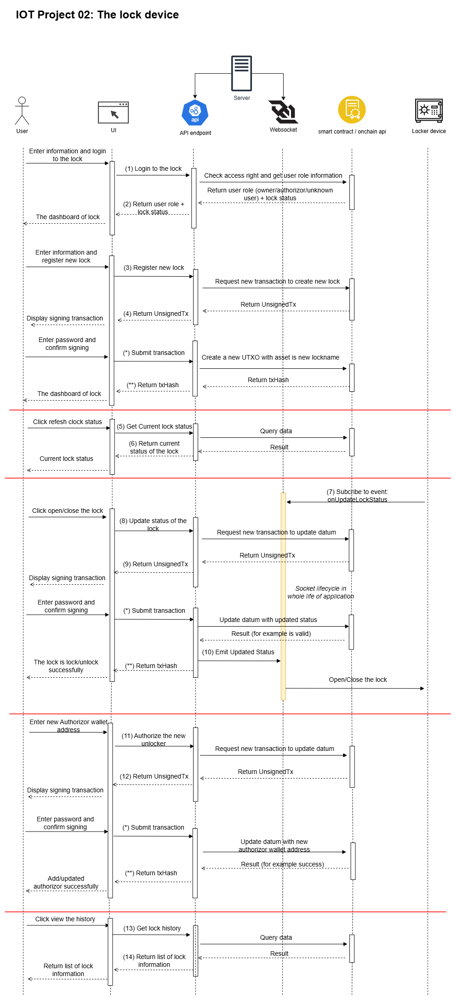

# IoT2 - Cardano Smart Lock System

A comprehensive **IoT2 platform** that combines **IoT devices** with **Cardano blockchain** technology to create a secure, transparent, and decentralized **smart lock system** for safes, lockers, and cabinets.



## 📋 API Flow Documentation

### Authentication & Access Control

#### **(1) Login + (2) Return user role + lock status**
- **Access Method**: GET
- **Endpoint**: `/api/lock-device/login`
- **Request Body Schema**:
  ```json
  {
    "user_addr": "string",
    "lock_name": "string"
  }
  ```
- **Response Schema (JSON)**:
  ```json
  {
    "access_role": "number", // Accessible: 0=OWNER, 1=AUTHORITY, 2=NEW_USER, 3=UNKNOWN
    "lock_status": "number", // LockStatus: 1=LOCK (locked), 0=OPEN (unlocked), -1=NEW_LOCK
    "user_addr": "string",
    "lock_name": "string"
  }
  ```

---

#### **(3) Register new lock + (4) Return UnsignedTx**
- **Access Method**: POST
- **Endpoint**: `/api/lock-device/register`
- **Request Body Schema**:
  ```json
  {
    "user_addr": "string",
    "lock_name": "string"
  }
  ```
- **Response Schema (JSON)**:
  ```json
  {
    "new_user_unsigned_tx": "string"
  }
  ```

---

#### **(5) Submit transaction + (7) Return txHash**
- **Access Method**: POST
- **Endpoint**: `/api/lock-device/submit-transaction`
- **Request Body Schema**:
  ```json
  {
    "user_addr": "string",
    "signedTx": "string",
    "data": "any"
  }
  ```
- **Response Schema (JSON)**:
  ```json
  {
    "tx_hash": "string",
    "tx_ref": "string"
  }
  ```

---

#### **(5) Get Current lock status + (6) Return current status of the lock**
- **Access Method**: GET
- **Endpoint**: `/api/lock-device/lock-status`
- **Request Body Schema (JSON)**: N/A (Query parameters)
- **Query Parameters**:
  ```json
  {
    "owner_addr": "string",
    "lock_name": "string"
  }
  ```
- **Response Schema (JSON)**:
  ```json
  {
    "lock_status": "number", // LockStatus: 1=LOCK (locked), 0=OPEN (unlocked), -1=NEW_LOCK
    "owner_addr": "string",
    "time": "Date",
    "tx_ref": "string"
  }
  ```

---

#### **(*) Subscribe to event: onUpdateLockStatus + (**) Emit Updated Status**
- **Access Method**: SOCKET.io
- **Endpoint**: `wss://hostname` (no specific path configured, uses default)
- **Event Name (listen/emit)**: `onUpdateLockStatus`
- **Event Payload (response)**:
  ```json
  {
    "is_unlock": "boolean",
    "unlocker_addr": "string"
  }
  ```

---

#### **(8) Update status of the lock + (9) Return unsignTx**
- **Access Method**: POST
- **Endpoint**: `/api/lock-device/update-status`
- **Request Body Schema (JSON)**:
  ```json
  {
    "lock_status": "number", // LockStatus: 1=LOCK (lock), 0=OPEN (unlock), -1=NEW_LOCK
    "owner_addr": "string",
    "unlocker_addr": "string",
    "owner_addr": "string",
    "time": "Date"
  }
  ```
- **Response Schema (JSON)**:
  ```json
  {
    "tx_hash": "string",
    "tx_ref": "string"
  }
  ```

---

#### **(9) Authorize the new unlocker + (10) Return post result**
- **Access Method**: POST
- **Endpoint**: `/api/lock-device/authorize`
- **Request Body Schema (JSON)**:
  ```json
  {
    "is_remove_authorize": "boolean", // false=grant access, true=revoke access
    "owner_addr": "string",
    "owner_addr": "string",
    "licensee_addr": "string",
    "time": "Date"
  }
  ```
- **Response Schema (JSON)**:
  ```json
  {
    "tx_hash": "string",
    "tx_ref": "string"
  }
  ```

---

#### **(11) Get lock history + (12) Return list of lock information**
- **Access Method**: GET
- **Endpoint**: `/api/lock-device/history`
- **Request Body Schema**: None
- **Response Schema (JSON)**:
  ```json
  [
    {
      "lock_status": "number", // LockStatus: 1=LOCK (locked), 0=OPEN (unlocked), -1=NEW_LOCK
      "user_addr": "string",
      "time": "Date",
      "tx_ref": "string"
    }
  ]
  ```

## 🏗️ System Architecture

The IoT2 Smart Lock System consists of three main components:

### 1. **Smart Contract Layer** (Aiken/Plutus)
- **Language**: Aiken
- **Validator**: `status_management.ak`
- **Purpose**: Manages on-chain authorization and lock status tracking
- **Features**:
  - Owner authorization management
  - Lock/unlock status tracking
  - Access control validation
  - Immutable audit trail

### 2. **Backend API Service** (NestJS)
- **Framework**: NestJS with TypeScript
- **Purpose**: Bridge between blockchain and IoT devices
- **Features**:
  - REST API endpoints for lock operations
  - WebSocket real-time status updates
  - Cardano transaction handling
  - Access rights management
  - Historical data retrieval

### 3. **Frontend Dashboard** (Next.js)
- **Framework**: Next.js 15 with React 19
- **Purpose**: User interface for lock management
- **Features**:
  - Cardano wallet integration
  - Real-time lock status monitoring
  - Authorization management
  - Transaction history viewing
  - Responsive design with Tailwind CSS

## 🚀 Quick Start

### Prerequisites

- **Node.js** 18+ and npm/yarn
- **Aiken** compiler for smart contracts
- **Cardano wallet** (Eternl, Nami, etc.)
- **Blockfrost API key** for Cardano network access

### Installation

1. **Clone the repository**
```bash
git clone <repository-url>
cd iot2
```

2. **Setup Backend**
```bash
cd back-end
npm install
cp .env.example .env
# Configure your .env file with Blockfrost API key and other settings
```

3. **Setup Frontend**
```bash
cd ../front-end
npm install
cp .env.example .env
# Configure your .env file with API endpoints
```

4. **Build Smart Contract**
```bash
cd ../back-end/contract
aiken build
```

### Running the Application

1. **Start Backend Service**
```bash
cd back-end
npm run start:dev
```
The API will be available at `http://localhost:3000`

2. **Start Frontend Dashboard**
```bash
cd front-end
npm run dev
```
The dashboard will be available at `http://localhost:3003`

## 📡 API Documentation

### Core Endpoints

#### **GET** `/api/lock-device/get-access/{wallet_address}`
Get user access rights for the smart lock.

**Response:**
```json
{
  "status": true,
  "statusCode": 201,
  "data": 0,  // 0 = owner, 1 = authorized user, -1 = no access
  "timestamp": "2025-08-29T10:30:45Z"
}
```

#### **GET** `/api/lock-device/lock-status`
Retrieve current lock status.

**Response:**
```json
{
  "status": true,
  "lock_status": true,    // true = locked, false = unlocked
  "user_addr": "string",  // Last user wallet address
  "time": "2025-08-29T10:30:45.000Z",
  "tx_ref": "string"      // Cardano explorer URL
}
```

#### **POST** `/api/lock-device/update-status`
Update lock status (lock/unlock).

**Request:**
```json
{
  "is_unlock": true,
  "unlocker_addr": "addr_test1...",
  "time": "2025-08-29T10:30:45.000Z"
}
```

#### **POST** `/api/lock-device/authorize`
Authorize or revoke user access.

**Request:**
```json
{
  "is_remove_authorize": false,
  "authorizer_addr": "addr_test1...",
  "licensee_addr": "addr_test1...",
  "time": "2025-08-29T10:30:45.000Z"
}
```

#### **GET** `/api/lock-device/history`
Get complete lock operation history.

### WebSocket Events

**Event:** `onUpdatedLockStatus`
Real-time lock status updates via Socket.io.

**Payload:**
```json
{
  "is_unlock": true,
  "unlocker_addr": "addr_test1..."
}
```

## 🔧 Technology Stack

### Backend
- **Framework**: NestJS
- **Language**: TypeScript
- **Database**: Cardano Blockchain
- **Real-time**: Socket.io WebSockets
- **Blockchain**: Mesh SDK, Blockfrost API
- **Testing**: Jest

### Frontend
- **Framework**: Next.js 15
- **Language**: TypeScript
- **UI Library**: React 19
- **Styling**: Tailwind CSS
- **Animations**: Framer Motion
- **Icons**: Lucide React
- **State Management**: Zustand
- **Wallet Integration**: Mesh SDK

### Smart Contract
- **Language**: Aiken
- **Platform**: Cardano Plutus
- **Network**: Preprod Testnet

## 🏭 Development

### Project Structure

```
iot2/
├── back-end/                 # NestJS API Service
│   ├── src/                  # Source code
│   ├── contract/             # Aiken smart contracts
│   ├── test/                 # Test files
│   └── docs/                 # Documentation
├── front-end/                # Next.js Dashboard
│   ├── src/                  # Source code
│   ├── public/               # Static assets
│   └── components/           # React components
└── README.md                 # This file
```

### Available Scripts

#### Backend
```bash
npm run start:dev        # Development server
npm run build           # Build for production
npm run test            # Run tests
npm run build:contract  # Build Aiken contracts
```

#### Frontend
```bash
npm run dev             # Development server
npm run build           # Build for production
npm run start           # Production server
npm run lint            # ESLint check
```

### Environment Configuration

#### Backend (.env)
```env
BLOCKFROST_API_KEY=your_blockfrost_api_key
SELLER=your_wallet_mnemonic
CONTRACT_ADDRESS=addr_test1...
```

#### Frontend (.env)
```env
NEXT_PUBLIC_API_ENDPOINT=http://localhost:3000
NEXT_PUBLIC_WEBSOCKET=ws://localhost:3000
```

## 🔒 Security Features

- **Blockchain Authorization**: All access rights stored on Cardano blockchain
- **Immutable Audit Trail**: Complete operation history on-chain
- **Wallet-based Authentication**: Cryptographic wallet signatures
- **Real-time Monitoring**: Instant status updates via WebSockets
- **Owner Controls**: Granular permission management

## 🌐 Network Support

- **Testnet**: Cardano Preprod (Current)
- **Mainnet**: Ready for production deployment
- **Explorer**: CardanoScan integration for transaction viewing

## 📊 Features

### For Device Owners
- ✅ **Grant/Revoke Access**: Authorize other users
- ✅ **Real-time Monitoring**: Live lock status updates
- ✅ **Complete History**: View all lock operations
- ✅ **Secure Control**: Blockchain-based authorization

### For Authorized Users
- ✅ **Remote Access**: Unlock devices remotely
- ✅ **Status Visibility**: Current lock state
- ✅ **Transaction Records**: Personal usage history

### For Developers
- ✅ **REST API**: Complete programmatic access
- ✅ **WebSocket Events**: Real-time integration
- ✅ **Smart Contracts**: Customizable blockchain logic
- ✅ **Open Source**: MIT licensed codebase

## 🚀 Deployment

### Docker Support

The project includes comprehensive Docker support with multi-stage builds for optimized production deployment.

#### Quick Start with Docker

**Production deployment:**
```bash
# Build and start all services
docker-compose up -d

# View logs
docker-compose logs -f

# Stop services
docker-compose down
```

**Development mode:**
```bash
# Start development environment with hot reload
docker-compose -f docker-compose.dev.yml up -d

# View logs
docker-compose -f docker-compose.dev.yml logs -f

# Stop development services
docker-compose -f docker-compose.dev.yml down
```

#### Docker Configuration

**Production Services:**
- **Backend API**: `http://localhost:3000`
- **Frontend Dashboard**: `http://localhost:3003`
- **Nginx Proxy**: `http://localhost:80` (optional, with production profile)

**Development Services:**
- **Backend API**: `http://localhost:3000` (with debug port 9229)
- **Frontend Dashboard**: `http://localhost:3003` (with hot reload)

#### Production with Nginx

```bash
# Start with Nginx reverse proxy
docker-compose --profile production up -d

# Access application via Nginx
# Frontend: http://localhost
# API: http://localhost/api
```

#### Individual Service Management

```bash
# Build specific service
docker-compose build backend
docker-compose build frontend

# Start specific service
docker-compose up backend -d
docker-compose up frontend -d

# Scale services (if needed)
docker-compose up --scale backend=2 -d
```

#### Environment Configuration

Create `.env` files in respective directories:

**back-end/.env:**
```env
BLOCKFROST_API_KEY=your_blockfrost_api_key
SELLER=your_wallet_mnemonic
SERVER_PORT=3000
FRONT_END_HOST=http://localhost:3003
```

**front-end/.env:**
```env
NEXT_PUBLIC_API_ENDPOINT=http://localhost:3000
NEXT_PUBLIC_WEBSOCKET=ws://localhost:3000
```

### Production Checklist

- [ ] Configure production Blockfrost API key
- [ ] Set up mainnet wallet addresses
- [ ] Deploy smart contracts to mainnet
- [ ] Configure production environment variables
- [ ] Set up monitoring and logging
- [ ] Configure HTTPS and security headers

## 🤝 Contributing

1. Fork the repository
2. Create your feature branch (`git checkout -b feature/amazing-feature`)
3. Commit your changes (`git commit -m 'Add some amazing feature'`)
4. Push to the branch (`git push origin feature/amazing-feature`)
5. Open a Pull Request

## 📝 License

This project is licensed under the **MIT License** with additional terms for blockchain components. 

The MIT License allows for:
- ✅ **Commercial use**
- ✅ **Modification** 
- ✅ **Distribution**
- ✅ **Private use**

**Additional considerations:**
- 🔐 **Blockchain Security**: Users are responsible for securing private keys and testing smart contracts
- 📋 **Regulatory Compliance**: Ensure compliance with local cryptocurrency regulations
- 🧪 **Testing Requirements**: Thoroughly test on testnets before mainnet deployment
- ⚠️ **IoT Security**: Conduct security audits when controlling physical devices

See the [LICENSE](LICENSE) file for complete terms and conditions.

## 🆘 Support

For support and questions:

- **Issues**: Create a GitHub issue
- **Documentation**: Check the `/docs` folder
- **API Reference**: See backend README.md

---

**Built with ❤️ for the Cardano IoT ecosystem**
