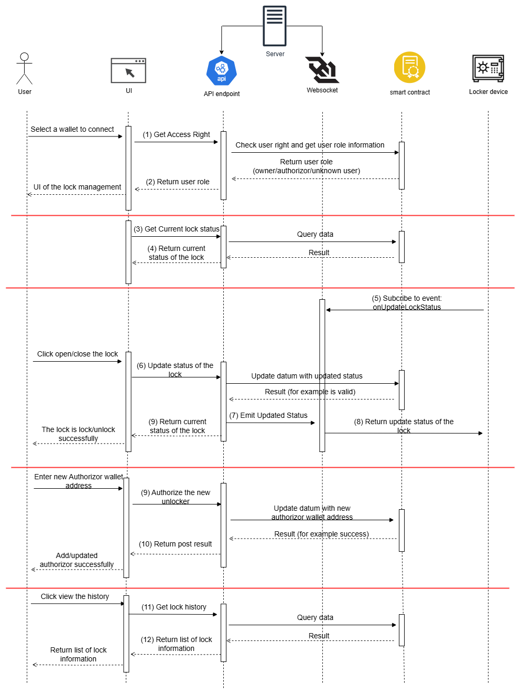

# Smart Lock Service API (IoT2)

This project is an **IoT2 platform combining IoT devices and Cardano blockchain** to build a secure and transparent **smart lock system** (for safes, lockers, and cabinets).  
The IoT layer manages lock/unlock operations in real-time, while Cardano blockchain provides tamper-proof storage for access rights, lock status history, and authorization records.



*(The diagram above illustrates the flow of lock/unlock operations and blockchain tracking. Below are the API and event details.)*

---

## 1. Get Access Right & Return User Role
**Method:** `GET /api/lock-device/get-access/{wallet_address}`

- **Path param**
  - `wallet_address` (string): Cardano wallet address of the user

- **Response schema**
```json
{
  "status": true,
  "statusCode": 201,
  "path": "/api/lock-device/get-access/{wallet_address}",
  "message": "success",
  "data": 0,   // 0 = owner, 1 = authorized user, -1 = no access
  "timestamp": "2025-08-24T10:30:45Z"
}
```

---

## 2. Get Current Lock Status
**Method:** `GET /api/lock-device/lock-status`

- **Response schema**
```json
{
  "status": true,
  "statusCode": 201,
  "path": "/api/lock-device/lock-status",
  "message": "success",
  "lock_status": true,   // true = locked, false = unlocked
  "user_addr": "string", // Cardano wallet address of last user
  "time": "2025-08-24T10:30:45.000Z",
  "tx_ref": "string",    // Cardano explorer URL
  "timestamp": "2025-08-24T10:30:45Z"
}
```

---

## 3. Subscribe to Lock Status Updates
**Method:** `Socket.io`  

- **Path:** `ws://hostname` (default)  
- **Event:** `onUpdatedLockStatus`

- **Payload**
```json
{
  "is_unlock": true,
  "unlocker_addr": "string"
}
```

---

## 4. Update Lock Status
**Method:** `POST /api/lock-device/update-status`

- **Request body**
```json
{
  "is_unlock": true,
  "unlocker_addr": "string", // Cardano wallet address
  "time": "2025-08-24T10:30:45.000Z"
}
```

- **Response body**
```json
{
  "status": true,
  "statusCode": 201,
  "path": "/api/lock-device/update-status",
  "message": "success",
  "data": "string", // unsigned transaction hex
  "timestamp": "2025-08-24T10:30:45Z"
}
```

---

## 5. Authorize / Remove Authorize Unlocker
**Method:** `POST /api/lock-device/authorize`

- **Request body**
```json
{
  "is_remove_authorize": false,
  "authorizer_addr": "string", // Cardano wallet address of authorizer
  "licensee_addr": "string",   // Cardano wallet address of licensee
  "time": "2025-08-24T10:30:45.000Z"
}
```

- **Response body**
```json
{
  "status": true,
  "statusCode": 201,
  "path": "/api/lock-device/authorize",
  "message": "success",
  "data": "string", // unsigned transaction hex
  "timestamp": "2025-08-24T10:30:45Z"
}
```

---

## 6. Get Lock History
**Method:** `GET /api/lock-device/history`

- **Response schema**
```json
{
  "status": true,
  "statusCode": 201,
  "path": "/api/lock-device/history",
  "message": "success",
  "data": [
    {
      "lock_status": true,
      "user_addr": "string", // Cardano wallet address
      "time": "2025-08-24T10:30:45.000Z",
      "tx_ref": "string"     // Cardano explorer URL
    }
  ],
  "timestamp": "2025-08-24T10:30:45Z"
}
```
---

> 📌 This README provides both the visual overview and detailed API/event documentation for the IoT2 Smart Lock System integrated with Cardano blockchain.
