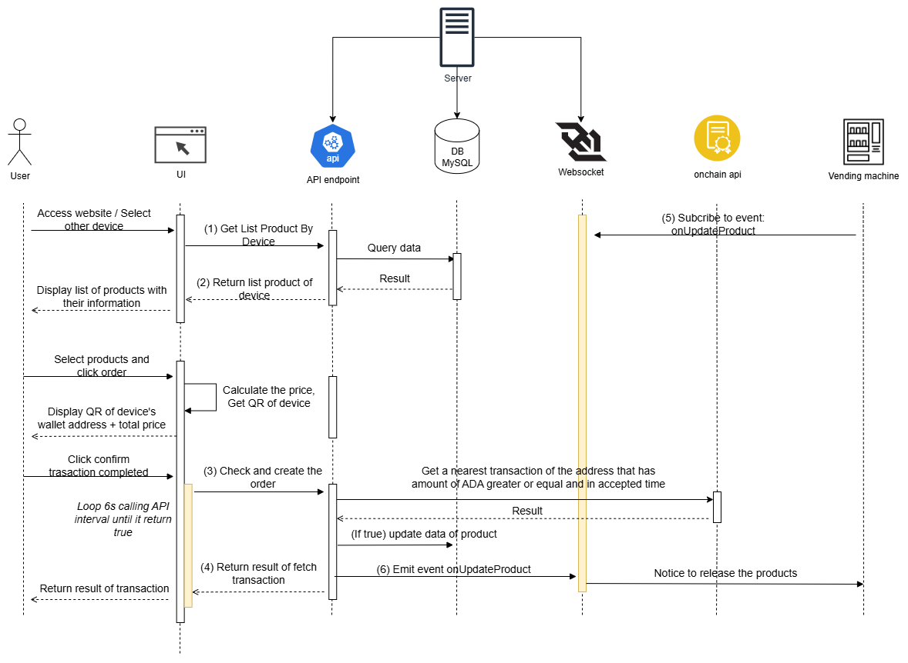

# IoT3 Vending Machine - Cardano IoT Example

A full-stack IoT vending machine application that demonstrates blockchain integration with Cardano, featuring real-time device monitoring, product management, and payment processing capabilities.



## 📋 API Documentation

### 1. Get List Product By Device

**Endpoint:** `/api/products/device/:device_id`
- **Method:** GET
- **Description:** Return list of products for a specific device
- **Request Body:** None

**Response Schema:**
```json
{
  "device_id": "number",
  "device_name": "string",
  "wallet_address": "string",
  "device_ip": "string",
  "device_location": "string",
  "device_type": "number",
  "device_version": "number",
  "created_at": "string", // Date
  "updated_at": "string", // Date
  "products": [
    {
      "product_id": "number",
      "product_name": "string",
      "product_price": "number",
      "product_image": "string",
      "created_at": "string", // Date
      "updated_at": "string", // Date
      "product_quantity": "number",
      "row": "number",
      "column": "number"
    }
  ]
}
```

### 2. Check and Create Order

**Endpoint:** `/api/order`
- **Method:** POST
- **Description:** Return result of fetch transaction

**Request Body Schema:**
```json
{
  "device_id": "number",
  "order_product": [
    {
      "product_id": "number",
      "quantity": "number"
    }
  ],
  "order_payment": "number", // enum: 1=COIN, 2=QR, 3=CASH
  "order_at": "string" // Date (optional)
}
```

**Response Schema:**
```json
{
  "device_id": "number",
  "order_product": [
    {
      "product_id": "number",
      "quantity": "number"
    }
  ],
  "order_payment": "number", // enum: 1=COIN, 2=QR, 3=CASH
  "order_at": "string" // Date
}
```

### 3. WebSocket Events

**Connection:** `ws://hostname` (WebSocket connection with CORS enabled for all origins)

#### Subscribe to Event: onUpdateProduct
- **Event Name:** `onUpdateProduct`
- **Description:** Listen for product updates
- **Event Payload:**
```json
{
  "product_id": "number",
  "device_id": "number",
  "updated_quantity": "number",
  "row": "number",
  "column": "number",
  "release_quantity": "number"
}
```

#### Emit Event: onUpdateProduct
- **Event Name:** `onUpdateProduct`
- **Description:** Emit product update events
- **Usage:** Clients should listen for `onUpdateProduct` events for real-time product quantity updates

## 🏗️ Project Overview

This project simulates a smart vending machine ecosystem with IoT device integration and Cardano blockchain payment capabilities. It consists of:

- **Back-end**: NestJS API server with WebSocket support
- **Front-end**: Next.js React application with real-time UI
- **Blockchain**: Cardano integration using MeshSDK and Blockfrost

## 🎯 Features

- **Device Management**: Monitor multiple vending machines with real-time status
- **Product Catalog**: Dynamic product inventory with stock management
- **Shopping Cart**: Interactive cart with quantity controls
- **Real-time Updates**: WebSocket connections for live device status
- **Payment Processing**: Cardano blockchain payment integration
- **Order Management**: Complete order lifecycle tracking
- **API Documentation**: Swagger/OpenAPI documentation

## 🏛️ Architecture

```
┌─────────────────┐    ┌─────────────────┐    ┌─────────────────┐
│   Frontend      │    │   Backend       │    │   Blockchain    │
│   (Next.js)     │◄──►│   (NestJS)      │◄──►│   (Cardano)     │
│   Port: 3005    │    │   Port: 3004    │    │   (Testnet)     │
└─────────────────┘    └─────────────────┘    └─────────────────┘
        │                       │                       │
        │                       │                       │
        ▼                       ▼                       ▼
┌─────────────────┐    ┌─────────────────┐    ┌─────────────────┐
│   React UI      │    │   REST API      │    │   MeshSDK       │
│   - Components  │    │   - Controllers │    │   - Wallet      │
│   - Real-time   │    │   - WebSockets  │    │   - Payments    │
│   - State Mgmt  │    │   - Database    │    │   - Blockfrost  │
└─────────────────┘    └─────────────────┘    └─────────────────┘
```

## 🛠️ Technology Stack

### Back-end
- **Framework**: NestJS v11.x
- **Runtime**: Node.js with TypeScript
- **Database**: MySQL with TypeORM
- **WebSockets**: Socket.IO for real-time communication
- **Documentation**: Swagger/OpenAPI
- **Blockchain**: 
  - MeshSDK v1.8.0 for Cardano integration
  - Blockfrost API for blockchain data
- **Validation**: Class-validator and class-transformer
- **Logging**: Winston with nest-winston

### Front-end
- **Framework**: Next.js v15.2.2 (App Router)
- **UI Library**: React v19.x
- **Styling**: TailwindCSS v4.x
- **Components**: Radix UI primitives
- **Icons**: Lucide React
- **Forms**: Zod validation
- **Notifications**: Sonner toast
- **QR Codes**: next-qrcode

## 📦 Project Structure

```
iot3/
├── back-end/                 # NestJS API Server
│   ├── src/
│   │   ├── entities/         # Database entities
│   │   ├── models/           # Data models and DTOs
│   │   ├── gateway/          # WebSocket gateway
│   │   └── common/           # Shared utilities
│   ├── data/                 # Sample JSON data
│
└── front-end/                # Next.js Web App
    ├── src/
    │   ├── app/              # App router pages
    │   ├── components/       # React components
    │   │   ├── ui/           # Base UI components
    │   │   └── layout/       # Layout components
    │   ├── api/              # API client utilities
    │   ├── types/            # TypeScript definitions
    │   ├── hooks/            # Custom React hooks
    │   └── lib/              # Utility functions
    └── public/               # Static assets
```

## 🚀 Quick Start

### Prerequisites

- Node.js v18+ and npm
- MySQL database
- Cardano testnet wallet (optional for blockchain features)

### 1. Clone and Setup

```bash
git clone <repository-url>
cd iot3
```

### 2. Back-end Setup

```bash
cd back-end
npm install

# Configure environment
cp .env.example .env
# Edit .env with your database and Cardano credentials

# Run database migrations (if using TypeORM migrations)
npm run build

# Start development server
npm run start:dev
```

The back-end will be available at `http://localhost:3004`
- API Documentation: `http://localhost:3004/api`

### 3. Front-end Setup

```bash
cd front-end
npm install

# Configure environment
cp .env.example .env
# Edit .env with your API endpoint

# Start development server
npm run dev
```

The front-end will be available at `http://localhost:3005`

## 🔧 Configuration

### Back-end Environment Variables

```bash
# Database Configuration
DB_DRIVER=mysql
DB_HOST=localhost
DB_PORT=3306
DB_NAME=iot3_vending_machine
DB_USER=root
DB_PASSWORD=your_password

# Cardano Blockchain
APP_WALLET="your mnemonic phrase here"
BLOCKFROST_API_KEY="your_blockfrost_api_key"

# Server Configuration
SERVER_PORT=3004
FRONT_END_HOST="http://localhost:3005"
```

### Front-end Environment Variables

```bash
NEXT_PUBLIC_API_ENDPOINT="http://localhost:3004/api"
NEXT_PUBLIC_WEBSOCKET="ws://localhost:3004"
```

## 🧪 Development

### Running Tests

```bash
# Back-end tests
cd back-end
npm run test           # Unit tests
npm run test:e2e       # End-to-end tests
npm run test:cov       # Coverage report

# Front-end tests
cd front-end
npm run lint           # ESLint checks
```

### API Documentation

Once the back-end is running, visit `http://localhost:3004/api` for interactive Swagger documentation.

### Database Seeding

The application includes sample data seeding:

```bash
# Using the API endpoint
POST http://localhost:3004/api/seeding-data
```

## 🐳 Docker Deployment

### Production Deployment with Docker Compose

The complete application stack can be deployed using Docker Compose:

```bash
# Build and start all services
docker-compose up -d

# View logs
docker-compose logs -f

# Stop services
docker-compose down

# Rebuild and restart
docker-compose up --build -d
```

### Development with Docker Compose

For development with hot reloading:

```bash
# Start development environment
docker-compose -f docker-compose.dev.yml up -d

# View logs
docker-compose -f docker-compose.dev.yml logs -f

# Stop development environment
docker-compose -f docker-compose.dev.yml down
```

### Individual Container Builds

```bash
# Back-end
cd back-end
docker build -t iot3-backend .
docker run -p 3004:3004 iot3-backend

# Front-end
cd front-end
docker build -t iot3-frontend .
docker run -p 3005:3005 iot3-frontend
```

### Docker Services

The Docker Compose setup includes:

- **MySQL 8.0**: Database service on port 3306
- **Backend API**: NestJS service on port 3004
- **Frontend Web**: Next.js service on port 3005
- **Redis**: Caching service on port 6379 (optional)
- **Nginx**: Reverse proxy for production (optional)

### Environment Variables for Docker

Create `.env` files or modify docker-compose.yml environment sections:

```yaml
# Database credentials
MYSQL_ROOT_PASSWORD=rootpassword
MYSQL_DATABASE=iot3_vending_machine
MYSQL_USER=iot3user
MYSQL_PASSWORD=iot3password

# Cardano configuration
APP_WALLET="your mnemonic phrase"
BLOCKFROST_API_KEY="your_blockfrost_key"
```

## 🔗 API Endpoints

### Core Endpoints

- `GET /api/devices` - List all vending machines
- `GET /api/products` - Get product catalog
- `POST /api/orders` - Create new order
- `GET /api/devices/:id/details` - Get device details
- `POST /api/seeding-data` - Initialize sample data

### WebSocket Events

- `device-status-update` - Real-time device status
- `inventory-update` - Stock level changes
- `order-status` - Order processing updates

## 🚦 Production Deployment

### Build for Production

```bash
# Back-end
cd back-end
npm run build
npm run start:prod

# Front-end
cd front-end
npm run build
npm run start
```

### Environment Considerations

- Configure proper database credentials
- Set up Cardano mainnet integration
- Configure CORS for production domains
- Set up SSL/TLS certificates
- Configure logging and monitoring

## 🤝 Contributing

1. Fork the repository
2. Create a feature branch
3. Make your changes
4. Add tests if applicable
5. Submit a pull request

## 📝 License

This project is licensed under the UNLICENSED license - see the package.json files for details.

## 🆘 Support

For issues and questions:

1. Check the API documentation at `/api`
2. Review the console logs for debugging
3. Verify environment configuration
4. Check database connectivity

---

*Built with ❤️ for the Cardano ecosystem*
