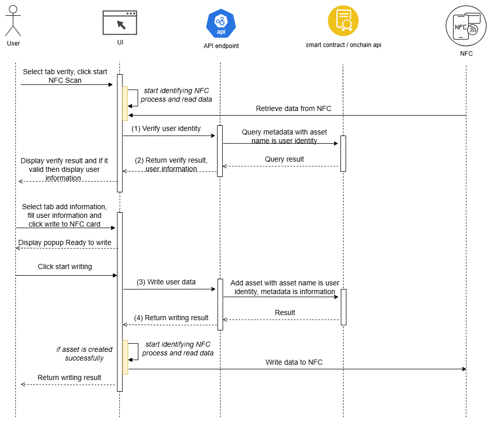

# IoT 4: Decentralized Identity with NFC Card

## 🌟 Overview

**IoT 4: Decentralized Identity** is a blockchain-based identity verification system that leverages **NFC (Near Field Communication)** technology and the **Cardano blockchain** to create secure, tamper-proof digital identities. This system enables users to store their identity information on the blockchain and access it through NFC cards, providing a decentralized alternative to traditional identity management systems.



## 📡 API Flow Documentation

### 1. **Submit User Identity Data**

**Endpoint**: `POST /api/user-identity`

**Purpose**: Write user data and return writing result

**Request Schema**:
```json
{
  "user_id": "string",           // The identity of person (e.g., "0013812389912")
  "user_fullname": "string",     // The name of person (e.g., "Peter Pan JM")
  "user_birthday": "Date",       // The date of birth (ISO date format)
  "user_gender": "string",       // The gender of person (e.g., "male", "female")
  "user_country": "string"       // The country of person (e.g., "Viet Nam")
}
```

**Response Schema**:
```json
{
  "status": true,                           // Boolean indicating success/failure
  "statusCode": 201,                        // HTTP status code
  "path": "/api/user-identity",             // Request path
  "message": "success",                     // Response message
  "data": "string",                         // Transaction URL (e.g., "https://preprod.cexplorer.io/tx/[TxHash]")
  "timestamp": "2025-10-09 12:00:00"        // Response timestamp in format yyyy-MM-dd HH:mm:ss
}
```

### 2. **Verify User Identity**

**Endpoint**: `POST /api/user-identity/verify`

**Purpose**: Verify user identity and return verification result with user information

**Request Schema**:
```json
{
  "user_id": "string"              // The identity of person to verify (e.g., "0013812389912")
}
```

**Response Schema**:
```json
{
  "status": true,                           // Boolean indicating success/failure
  "statusCode": 200,                        // HTTP status code
  "path": "/api/user-identity/verify",      // Request path
  "message": "success",                     // Response message
  "data": {                                 // User metadata retrieved from blockchain
    "user_fullname": "string",              // The name of person
    "user_birthday": "Date",                // The date of birth
    "user_gender": "string",                // The gender of person
    "user_country": "string"                // The country of person
  },
  "timestamp": "2025-10-09 12:00:00"        // Response timestamp in format yyyy-MM-dd HH:mm:ss
}
```


## 🚀 Key Features

- **🔗 Blockchain-based Identity Storage**: Identity data is securely stored on the Cardano blockchain using smart contracts
- **📱 NFC Card Integration**: Read and write identity data to/from NFC cards for easy access
- **🔒 Decentralized Verification**: No central authority needed - verification happens directly on the blockchain
- **🛡️ Tamper-proof Records**: Immutable identity records protected by blockchain technology
- **🌐 Web-based Interface**: User-friendly web application for identity management
- **⚡ Real-time Verification**: Instant identity verification through blockchain queries
- **🔐 Cryptographic Security**: Advanced cryptographic protection using Cardano's Plutus smart contracts

## 🏗️ System Architecture

The system consists of three main components:

### 1. **Back-end API** (NestJS + Cardano Integration)
- RESTful API for identity management
- Cardano blockchain integration using MeshSDK
- Smart contract deployment and interaction
- Transaction management and verification

### 2. **Front-end Application** (Next.js + TailwindCSS)
- Modern web interface for identity management
- NFC card reading and writing simulation
- Real-time verification results
- Responsive design with Shadcn/UI components

### 3. **Smart Contracts** (Aiken/Plutus)
- Decentralized identity validator
- CIP-68 standard compliance for metadata
- Secure on-chain identity storage

## 📋 Technology Stack

### Backend
- **Framework**: NestJS (Node.js)
- **Blockchain**: Cardano (Preprod Testnet)
- **Smart Contracts**: Aiken/Plutus
- **SDK**: MeshSDK for Cardano integration
- **API Documentation**: Swagger/OpenAPI
- **Validation**: Class-validator, Class-transformer
- **Logging**: Winston

### Frontend
- **Framework**: Next.js 15 (React 19)
- **Styling**: TailwindCSS
- **UI Components**: Shadcn/UI, Radix UI
- **State Management**: React Hooks
- **Notifications**: Sonner
- **HTTP Client**: Custom fetch wrapper
- **TypeScript**: Full type safety

### Blockchain
- **Network**: Cardano Preprod Testnet
- **Smart Contract Language**: Aiken
- **Metadata Standard**: CIP-68
- **Token Standard**: Native tokens for identity representation

## 🛠️ Installation & Setup

### Prerequisites
- Node.js 18+ and npm
- Cardano wallet with testnet ADA
- Aiken compiler (for smart contract development)

### 1. Clone the Repository
```bash
git clone https://github.com/htlabs-xyz/cardano-iot-example.git
cd cardano-iot-example/iot4
```

### 2. Backend Setup
```bash
cd back-end

# Install dependencies
npm install

# Copy environment variables
cp .env.example .env

# Configure your wallet mnemonic and Blockfrost API key in .env
# APP_WALLET=your_wallet_mnemonic_words_here
# BLOCKFROST_PROJECT_ID=your_blockfrost_project_id

# Build smart contracts
cd contract
aiken build
cd ..

# Start development server
npm run start:dev
```

The backend API will be available at `http://localhost:3006`
API documentation: `http://localhost:3006/api`

### 3. Frontend Setup
```bash
cd front-end

# Install dependencies
npm install

# Copy environment variables
cp .env.example .env

# Configure backend API URL in .env
# NEXT_PUBLIC_API_URL=http://localhost:3006/api

# Start development server
npm run dev
```

The frontend application will be available at `http://localhost:3007`

## 🔧 Configuration

### Backend Environment Variables
```env
# Cardano Wallet Configuration
APP_WALLET=your_24_word_mnemonic_phrase_here

# Blockfrost API (for Cardano interaction)
BLOCKFROST_PROJECT_ID=your_blockfrost_project_id
BLOCKFROST_URL=https://cardano-preprod.blockfrost.io/api/v0

# Server Configuration
SERVER_PORT=3006
FRONT_END_HOST=http://localhost:3007
```

### Frontend Environment Variables
```env
# API Configuration
NEXT_PUBLIC_API_URL=http://localhost:3006/api
```

## 📚 API Documentation

### Core Endpoints

#### 1. Submit User Identity
```http
POST /api/user-identity
Content-Type: application/json

{
  "user_id": "20251006012248",
  "user_fullname": "John Doe",
  "user_birthday": "1990-01-01T00:00:00.000Z",
  "user_gender": "male",
  "user_country": "United States"
}
```

#### 2. Verify User Identity
```http
POST /api/user-identity/verify
Content-Type: application/json

{
  "user_id": "20251006012248"
}
```

## 🎯 Use Cases

### 1. **Digital Identity Creation**
- Users can create tamper-proof digital identities
- Information is stored on Cardano blockchain
- NFC cards serve as physical access tokens

### 2. **Identity Verification**
- Instant verification through blockchain queries
- No need for centralized databases
- Cryptographically secure validation

### 3. **Access Control**
- NFC-based building or system access
- Decentralized authentication
- Audit trail on blockchain

### 4. **Government Services**
- Digital citizenship documents
- Voting system integration
- Social service eligibility verification

## 🔐 Security Features

- **Blockchain Immutability**: Records cannot be altered once confirmed
- **Cryptographic Signatures**: All transactions are cryptographically signed
- **Decentralized Storage**: No single point of failure
- **Privacy Protection**: Only necessary data is stored on-chain
- **Smart Contract Validation**: Automated verification rules

## 🧪 Testing

### Backend Tests
```bash
cd back-end

# Run unit tests
npm run test

# Run with coverage
npm run test:cov

# Run contract tests
npm run test contract.test.ts
```

### Smart Contract Tests
```bash
cd back-end/contract

# Run Aiken tests
aiken check

# Run specific tests
aiken check -m decentralize_identity
```

## 🚀 Deployment

### Production Deployment

1. **Smart Contracts**: Deploy to Cardano Mainnet
2. **Backend**: Deploy to cloud provider (AWS, GCP, Azure)
3. **Frontend**: Deploy to Vercel, Netlify, or similar platform

### Environment Setup
- Configure mainnet Blockfrost credentials
- Update network configurations
- Set up monitoring and logging

## 🗺️ Roadmap

- [ ] **Enhanced NFC Integration**: Real NFC hardware support
- [ ] **Mobile Applications**: Native iOS/Android apps
- [ ] **Multi-chain Support**: Ethereum, Polygon integration
- [ ] **Advanced Privacy**: Zero-knowledge proof implementation
- [ ] **Enterprise Features**: Role-based access control
- [ ] **Government Integration**: Official document support

## 🤝 Contributing

1. Fork the repository
2. Create a feature branch (`git checkout -b feature/amazing-feature`)
3. Commit your changes (`git commit -m 'Add amazing feature'`)
4. Push to the branch (`git push origin feature/amazing-feature`)
5. Open a Pull Request

## 📄 License

This project is licensed under the MIT License - see the [LICENSE](LICENSE) file for details.

## 🙏 Acknowledgments

- **Cardano Foundation** for blockchain infrastructure
- **MeshSDK** for Cardano development tools
- **Aiken** for smart contract development
- **NestJS** and **Next.js** communities
- **Cardano Fund 13** for project support

## 📞 Support

For questions, issues, or contributions:
- GitHub Issues: [Create an issue](https://github.com/htlabs-xyz/cardano-iot-example/issues)
- Documentation: [Project Wiki](https://github.com/htlabs-xyz/cardano-iot-example/wiki)

---

<p align="center">
  Built with ❤️ for the Cardano ecosystem
</p>